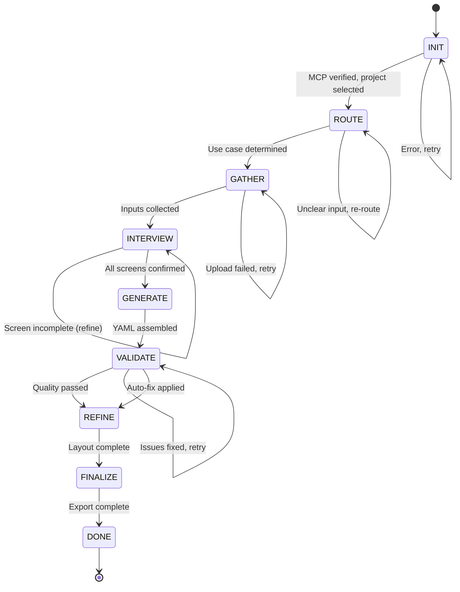

# Workflow Orchestration - State Machine Details

This document provides implementation details for the FlowSpec Architect state machine, including state transitions, checkpoint logic, error recovery, and Task system integration.

## State Machine Implementation

### State Definitions

```typescript
type WorkflowState =
  | 'INIT'      // Setup & verification
  | 'ROUTE'     // Determine use case
  | 'GATHER'    // Collect inputs
  | 'INTERVIEW' // User clarification loops
  | 'GENERATE'  // Build YAML
  | 'VALIDATE'  // Quality checks
  | 'REFINE'    // Layout & regions
  | 'FINALIZE'  // Export & tech spec
  | 'DONE';     // Workflow complete

type UseCase = 'UC1' | 'UC2' | 'UC3';

interface WorkflowContext {
  state: WorkflowState;
  useCase?: UseCase;
  projectId?: string;
  projectName?: string;
  screenIds?: string[];
  miniYamls?: string[];
  currentScreenIndex?: number;
  fullYaml?: string;
  analysisResults?: AnalysisResult;
  errors?: string[];
}
```

### State Transitions



### Checkpoint Logic

Each phase has one or more checkpoints. A checkpoint is a **named verification step** that must pass before advancing to the next state.

**Checkpoint Pattern:**
```
Phase X: STATE_NAME

  Step X.1: Action
  Step X.2: Action
  ...

  Checkpoint X.Y: Verification
  → IF conditions met: state = NEXT_STATE
  → ELSE: state = CURRENT_STATE (retry) or PREVIOUS_STATE (rollback)
```

**Example Checkpoint Implementation:**
```typescript
// Checkpoint 3.1: All screens created
function validateGatherPhase(context: WorkflowContext): boolean {
  if (!context.screenIds || context.screenIds.length === 0) {
    context.errors = ['No screens created. Upload wireframes first.'];
    return false;
  }
  return true;
}

// Transition
if (validateGatherPhase(context)) {
  context.state = 'INTERVIEW';
  context.currentScreenIndex = 0;
} else {
  // Stay in GATHER, display errors
}
```

## Task System Integration

Use Claude Code's Task system to persist state and enable resume.

### Task Structure

**Main Orchestration Task:**
```typescript
TaskCreate({
  subject: 'FlowSpec Architect - ${useCase}',
  description: 'State: ${state}, Project: ${projectName}',
  activeForm: 'Running FlowSpec Architect workflow',
  metadata: {
    workflowState: state,
    useCase: useCase,
    projectId: projectId,
    projectName: projectName,
    screenIds: JSON.stringify(screenIds),
    miniYamls: JSON.stringify(miniYamls),
    currentScreenIndex: currentScreenIndex
  }
});
```

**Phase-Specific Sub-Tasks:**
```typescript
// INTERVIEW phase: one task per screen
TaskCreate({
  subject: 'Interview Screen: ${screenName}',
  description: 'Gather data elements, types, constraints for ${screenName}',
  activeForm: 'Interviewing ${screenName}',
  metadata: {
    screenId: screenId,
    screenName: screenName,
    parentTaskId: orchestrationTaskId
  }
});
```

### State Persistence

**Save state after each checkpoint:**
```typescript
function saveState(taskId: string, context: WorkflowContext) {
  TaskUpdate({
    taskId: taskId,
    description: `State: ${context.state}, Project: ${context.projectName}`,
    metadata: {
      ...context,
      miniYamls: JSON.stringify(context.miniYamls),
      screenIds: JSON.stringify(context.screenIds)
    }
  });
}
```

**Load state on resume:**
```typescript
function loadState(taskId: string): WorkflowContext {
  const task = TaskGet(taskId);
  return {
    state: task.metadata.workflowState,
    useCase: task.metadata.useCase,
    projectId: task.metadata.projectId,
    projectName: task.metadata.projectName,
    screenIds: JSON.parse(task.metadata.screenIds || '[]'),
    miniYamls: JSON.parse(task.metadata.miniYamls || '[]'),
    currentScreenIndex: task.metadata.currentScreenIndex || 0
  };
}
```

## Resume Capability

**Interrupted Workflow Detection:**
```typescript
// Check for incomplete orchestration tasks
const tasks = TaskList();
const incompleteTasks = tasks.filter(t =>
  t.subject.startsWith('FlowSpec Architect') &&
  t.status === 'in_progress'
);

if (incompleteTasks.length > 0) {
  ASK: "Found incomplete FlowSpec workflow. Resume? [yes/no]"

  IF yes:
    context = loadState(incompleteTasks[0].id);
    resumeWorkflow(context);
}
```

**Resume Logic by State:**
```typescript
function resumeWorkflow(context: WorkflowContext) {
  switch (context.state) {
    case 'INIT':
    case 'ROUTE':
      // Quick phases, restart from beginning
      return startWorkflow();

    case 'GATHER':
      // Resume uploads from last successful upload
      return continueGather(context);

    case 'INTERVIEW':
      // Resume from currentScreenIndex
      return continueInterview(context);

    case 'GENERATE':
      // Regenerate from saved miniYamls
      return generateYaml(context.miniYamls);

    case 'VALIDATE':
      // Re-run analysis
      return validateYaml(context);

    case 'REFINE':
      // Continue layout/regions
      return refineProject(context);

    case 'FINALIZE':
      // Re-export
      return finalizeProject(context);

    default:
      return startWorkflow();
  }
}
```

## Error Recovery Strategies

### 1. Retry with Backoff

For transient errors (network, MCP timeout):
```typescript
async function retryOperation<T>(
  operation: () => Promise<T>,
  maxRetries: number = 3
): Promise<T> {
  for (let i = 0; i < maxRetries; i++) {
    try {
      return await operation();
    } catch (error) {
      if (i === maxRetries - 1) throw error;
      await sleep(1000 * (i + 1)); // Exponential backoff
    }
  }
  throw new Error('Max retries exceeded');
}
```

### 2. Rollback to Last Checkpoint

For validation failures or user-requested rollback:
```typescript
function rollbackToPreviousCheckpoint(context: WorkflowContext) {
  const stateSequence: WorkflowState[] = [
    'INIT', 'ROUTE', 'GATHER', 'INTERVIEW', 'GENERATE', 'VALIDATE', 'REFINE', 'FINALIZE'
  ];

  const currentIndex = stateSequence.indexOf(context.state);
  if (currentIndex > 0) {
    context.state = stateSequence[currentIndex - 1];
    saveState(context.taskId!, context);
  }
}
```

### 3. Manual State Override

For debugging or emergency recovery:
```typescript
ASK: "Override state? Current: ${context.state}. Available: INIT, ROUTE, GATHER, INTERVIEW, GENERATE, VALIDATE, REFINE, FINALIZE"

IF user provides state:
  WARN: "Manual state override can skip checkpoints. Proceed? [yes/no]"

  IF yes:
    context.state = userProvidedState;
    saveState(context.taskId!, context);
```

### 4. Partial Progress Preservation

Save intermediate results even on failure:
```typescript
// Always save miniYamls as they're created
function saveMiniYaml(context: WorkflowContext, screenName: string, yaml: string) {
  context.miniYamls = context.miniYamls || [];
  context.miniYamls.push(yaml);

  // Persist immediately (don't wait for full workflow completion)
  saveState(context.taskId!, context);

  // Also save to file for manual recovery
  const filename = `${context.projectName}_${screenName}_mini.yaml`;
  // Write to temp directory
}
```

## Quality Gate Implementation

### Validation Rules

```typescript
interface ValidationRule {
  name: string;
  check: (analysis: AnalysisResult) => boolean;
  message: string;
  severity: 'error' | 'warning';
  autoFix?: (projectId: string, analysis: AnalysisResult) => Promise<void>;
}

const VALIDATION_RULES: ValidationRule[] = [
  {
    name: 'no_orphans',
    check: (a) => a.orphans.length === 0,
    message: 'Found ${count} orphan node(s) with no edges',
    severity: 'error',
    autoFix: async (projectId, analysis) => {
      // Delete orphan nodes or prompt user to connect them
    }
  },
  {
    name: 'no_duplicates',
    check: (a) => a.duplicates.length === 0,
    message: 'Found ${count} duplicate label(s)',
    severity: 'error',
    autoFix: async (projectId, analysis) => {
      // Rename duplicates with suffix (_1, _2)
    }
  },
  {
    name: 'naming_consistent',
    check: (a) => a.namingViolations.length === 0,
    message: 'Found ${count} naming convention violation(s)',
    severity: 'warning',
    autoFix: async (projectId, analysis) => {
      // Apply suggested naming fixes
      for (const violation of analysis.namingViolations) {
        await flowspec_update_node(projectId, violation.nodeId, {
          label: violation.suggestion
        });
      }
    }
  },
  // ... more rules
];
```

### Auto-Fix Logic

```typescript
async function applyAutoFixes(
  projectId: string,
  analysis: AnalysisResult,
  rules: ValidationRule[]
) {
  const fixableRules = rules.filter(r => r.autoFix && !r.check(analysis));

  if (fixableRules.length === 0) return;

  ASK: "Apply auto-fixes for ${fixableRules.length} issue(s)? [yes/no/preview]"

  IF preview:
    // Show what would be changed
    for (const rule of fixableRules) {
      displayRuleFixes(rule, analysis);
    }

  IF yes:
    for (const rule of fixableRules) {
      await rule.autoFix(projectId, analysis);
    }

    // Re-import YAML to refresh canvas
    const yaml = await flowspec_get_yaml(projectId);
    await flowspec_import_yaml(projectId, yaml, { merge: false });

    // Re-validate
    const newAnalysis = await flowspec_analyse_project(projectId);
    return newAnalysis;
}
```

## Progressive YAML Assembly

### Mini-YAML Merging Algorithm

```typescript
interface MiniYaml {
  screenName: string;
  yaml: string;
  parsed: {
    dataPoints: DataPoint[];
    components: Component[];
    transforms: Transform[];
  };
}

function mergeMiniYamls(miniYamls: MiniYaml[]): string {
  const merged = {
    version: '1.2.0',
    dataPoints: [] as DataPoint[],
    components: [] as Component[],
    transforms: [] as Transform[],
    tables: [] as Table[],
    dataFlow: [] as Edge[],
    screens: [] as Screen[]
  };

  const nodeIdMap = new Map<string, string>(); // original ID → merged ID

  // 1. Merge DataPoints (deduplicate by label + type)
  for (const mini of miniYamls) {
    for (const dp of mini.parsed.dataPoints) {
      const existing = merged.dataPoints.find(
        d => d.label === dp.label && d.type === dp.type
      );

      if (existing) {
        // Merge constraints
        existing.constraints = [...new Set([
          ...existing.constraints,
          ...dp.constraints
        ])];
        nodeIdMap.set(dp.id, existing.id);
      } else {
        merged.dataPoints.push(dp);
        nodeIdMap.set(dp.id, dp.id);
      }
    }
  }

  // 2. Merge Components (no deduplication, each screen = unique component)
  for (const mini of miniYamls) {
    for (const comp of mini.parsed.components) {
      // Update references using nodeIdMap
      comp.displays = comp.displays.map(id => nodeIdMap.get(id) || id);
      comp.captures = comp.captures.map(id => nodeIdMap.get(id) || id);
      merged.components.push(comp);
    }
  }

  // 3. Merge Transforms (deduplicate by label + logic)
  for (const mini of miniYamls) {
    for (const tf of mini.parsed.transforms) {
      const existing = merged.transforms.find(
        t => t.label === tf.label && t.logic.content === tf.logic.content
      );

      if (!existing) {
        tf.inputs = tf.inputs.map(id => nodeIdMap.get(id) || id);
        tf.outputs = tf.outputs.map(id => nodeIdMap.get(id) || id);
        merged.transforms.push(tf);
      }
    }
  }

  // 4. Generate cross-screen edges
  merged.dataFlow = generateCrossScreenEdges(merged);

  // 5. Add screens metadata
  merged.screens = miniYamls.map(mini => ({
    id: mini.screenId,
    name: mini.screenName,
    imageUrl: mini.imageUrl,
    imageWidth: mini.imageWidth,
    imageHeight: mini.imageHeight,
    regions: [] // Added in REFINE phase
  }));

  return YAML.stringify(merged);
}
```

### Cross-Screen Edge Generation

```typescript
function generateCrossScreenEdges(spec: YamlSpec): Edge[] {
  const edges: Edge[] = [];

  // Component → DataPoint (displays)
  for (const comp of spec.components) {
    for (const displayId of comp.displays) {
      edges.push({
        from: displayId,
        to: comp.id,
        type: 'flows-to',
        label: 'displays in'
      });
    }
  }

  // Component → DataPoint (captures)
  for (const comp of spec.components) {
    for (const captureId of comp.captures) {
      edges.push({
        from: comp.id,
        to: captureId,
        type: 'flows-to',
        label: 'captures'
      });
    }
  }

  // Transform → DataPoint (outputs)
  for (const tf of spec.transforms) {
    for (const inputId of tf.inputs) {
      edges.push({
        from: inputId,
        to: tf.id,
        type: 'transforms',
        label: 'input to'
      });
    }
    for (const outputId of tf.outputs) {
      edges.push({
        from: tf.id,
        to: outputId,
        type: 'derives-from',
        label: 'produces'
      });
    }
  }

  return edges;
}
```

## Workflow Performance Optimization

### Parallel Checkpoint Validation

```typescript
// Run independent validations in parallel
async function validateCheckpoint(context: WorkflowContext): Promise<boolean> {
  const checks = [
    checkMCPConnection(),
    checkProjectExists(context.projectId),
    checkScreensCreated(context.screenIds),
    checkYamlValid(context.fullYaml)
  ];

  const results = await Promise.allSettled(checks);

  const failures = results.filter(r => r.status === 'rejected');
  if (failures.length > 0) {
    context.errors = failures.map(f => f.reason);
    return false;
  }

  return true;
}
```

### Incremental Progress Display

```typescript
// Show progress bar for multi-screen interviews
function displayInterviewProgress(context: WorkflowContext) {
  const current = context.currentScreenIndex || 0;
  const total = context.screenIds?.length || 0;
  const percent = Math.round((current / total) * 100);

  console.log(`\n📊 Interview Progress: ${current}/${total} (${percent}%)`);
  console.log(`[${'█'.repeat(current)}${'░'.repeat(total - current)}]`);
}
```

## Testing Workflow Orchestration

### Unit Tests for State Transitions

```typescript
describe('State Machine', () => {
  it('should transition INIT -> ROUTE when project selected', () => {
    const context = { state: 'INIT', projectId: 'test-123' };
    const nextState = transitionState(context);
    expect(nextState).toBe('ROUTE');
  });

  it('should stay in VALIDATE if quality checks fail', () => {
    const context = {
      state: 'VALIDATE',
      analysisResults: { orphans: [{ id: '1', label: 'orphan' }] }
    };
    const nextState = transitionState(context);
    expect(nextState).toBe('VALIDATE'); // Retry after fixes
  });
});
```

### Integration Test for Full Workflow

```typescript
describe('UC1: Wireframe -> Dataflow', () => {
  it('should complete full workflow with mock data', async () => {
    const workflow = new FlowSpecWorkflow();

    // INIT
    await workflow.init({ mockMCP: true });
    expect(workflow.state).toBe('ROUTE');

    // ROUTE
    workflow.provideInput({ wireframes: ['test.png'] });
    expect(workflow.state).toBe('GATHER');

    // GATHER
    await workflow.uploadWireframes();
    expect(workflow.state).toBe('INTERVIEW');

    // INTERVIEW (auto-confirm for test)
    await workflow.interviewScreens({ autoConfirm: true });
    expect(workflow.state).toBe('GENERATE');

    // GENERATE
    await workflow.generateYaml();
    expect(workflow.state).toBe('VALIDATE');

    // VALIDATE
    await workflow.validate();
    expect(workflow.state).toBe('REFINE');

    // REFINE
    await workflow.refine();
    expect(workflow.state).toBe('FINALIZE');

    // FINALIZE
    const result = await workflow.finalize();
    expect(workflow.state).toBe('DONE');
    expect(result.yamlPath).toBeDefined();
    expect(result.techSpecPath).toBeDefined();
  });
});
```
